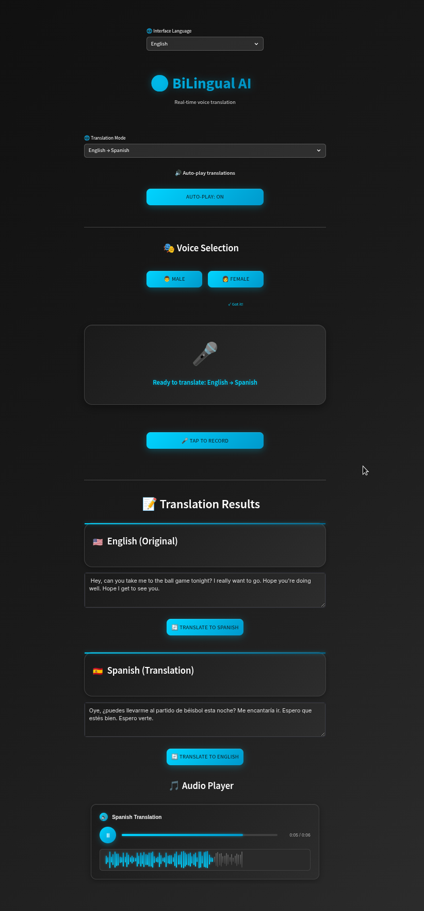

# BiLingual AI

[](https://bilingual-ai.streamlit.app)
[](https://www.python.org/downloads/)
[](https://groq.com)
[](https://elevenlabs.io)
[](https://opensource.org/licenses/MIT)

**Breaking language barriers with real-time voice translation powered by Groq's lightning-fast inference**



## Overview

BiLingual AI is a real-time voice translation application that seamlessly converts speech between languages. Currently supporting English and Spanish, with plans to expand to more languages and voices based on community requests.

### How It Works

The application leverages a powerful AI pipeline for instant translation:

1. **Voice Capture**: High-quality audio recording optimized for speech
2. **Speech Recognition**: Groq's Whisper Large v3 converts speech to text at incredible speeds
3. **Neural Translation**: Llama 3.3 70B provides context-aware translation
4. **Voice Synthesis**: ElevenLabs generates natural-sounding speech in the target language

All processing happens in real-time, powered by Groq's ultra-fast inference infrastructure.

## Key Features

### Core Functionality
- **Bidirectional Translation**: Seamless English ↔ Spanish conversion
- **Real-time Processing**: Translation at the speed of conversation
- **Voice Personalization**: Choose between male and female voices
- **Auto-play Mode**: Instant audio playback for natural dialogue flow
- **Text Editing**: Modify and retranslate text on the fly

### Interface Design
- **Bilingual UI**: Complete interface localization
- **Mobile Responsive**: Optimized for phones, tablets, and desktops
- **Dark Theme**: Eye-friendly design for extended use
- **Visual Feedback**: Real-time status indicators and waveform visualization

## Technology Stack

| Component | Technology | Purpose |
|-----------|------------|---------|
| **Frontend** | Streamlit | Responsive web interface |
| **Speech Recognition** | Groq + Whisper Large v3 | Ultra-fast speech-to-text |
| **Translation** | Groq + Llama 3.3 70B | High-quality neural translation |
| **Voice Synthesis** | ElevenLabs API | Natural multilingual voices |
| **Audio Processing** | SoundDevice + NumPy | Real-time audio capture |

## Performance

Powered by Groq's revolutionary LPU™ Inference Engine:
- **Speech Recognition**: < 1 second latency
- **Translation**: < 0.5 second response time
- **End-to-end**: Under 2 seconds for complete translation

## Getting Started

### Prerequisites
- Python 3.8 or higher
- Groq API key ([Get one here](https://console.groq.com))
- ElevenLabs API key ([Sign up](https://elevenlabs.io))

### Installation

```bash
# Clone the repository
git clone https://github.com/lliWcWill/bilingual-ai.git
cd bilingual-ai

# Install dependencies
pip install -r requirements.txt

# Configure API keys for local development
cp .env.example .env
# Edit .env with your API keys
```

### Running Locally

```bash
streamlit run app.py
```

Navigate to `http://localhost:8501` in your browser.

## Deployment

### Streamlit Community Cloud

1. Fork this repository
2. Sign in to [share.streamlit.io](https://share.streamlit.io)
3. Deploy from your GitHub repository
4. Add your API keys in the Streamlit dashboard under "Secrets"

### API Keys Setup

**Local Development:**
```bash
# .env file
GROQ_API_KEY=your_groq_api_key
ELEVEN_LABS=your_elevenlabs_api_key
```

**Streamlit Cloud Deployment:**
Add these in your Streamlit dashboard under "Secrets":
```toml
GROQ_API_KEY = "your_groq_api_key"
ELEVEN_LABS = "your_elevenlabs_api_key"
LOG_LEVEL = "INFO"
ENABLE_VERBOSE_LOGGING = "FALSE"
```

## Roadmap

### Planned Features
- **Language Expansion**: French, German, Mandarin, Japanese, and more
- **Voice Library**: Additional voice options per language
- **Conversation Mode**: Multi-turn dialogue support
- **Offline Mode**: Local processing capability
- **API Access**: RESTful API for developers

### Community Requests
We actively incorporate user feedback. Request new languages or features through [GitHub Issues](https://github.com/yourusername/bilingual-ai/issues).

## Architecture

```
┌─────────────┐     ┌─────────────┐     ┌─────────────┐
│   Browser   │────▶│  Streamlit  │────▶│  Audio      │
│   (User)    │◀────│   Server    │◀────│  Handler    │
└─────────────┘     └─────────────┘     └─────────────┘
                           │                     │
                           ▼                     ▼
                    ┌─────────────┐     ┌─────────────┐
                    │  Groq API   │     │ ElevenLabs  │
                    │  (STT+LLM)  │     │   (TTS)     │
                    └─────────────┘     └─────────────┘
```

## Contributing

We welcome contributions! See [CONTRIBUTING.md](CONTRIBUTING.md) for guidelines.

### Development Setup

```bash
# Create virtual environment
python -m venv venv
source venv/bin/activate  # or `venv\Scripts\activate` on Windows

# Install development dependencies
pip install -r requirements-dev.txt

# Run tests
pytest tests/
```

## License

This project is licensed under the MIT License - see the [LICENSE](LICENSE) file for details.

## Acknowledgments

- **Groq** for providing blazing-fast AI inference
- **ElevenLabs** for natural voice synthesis
- **Streamlit** for the intuitive web framework
- The open-source community for continuous inspiration

---

**Built to connect the world, one conversation at a time.**